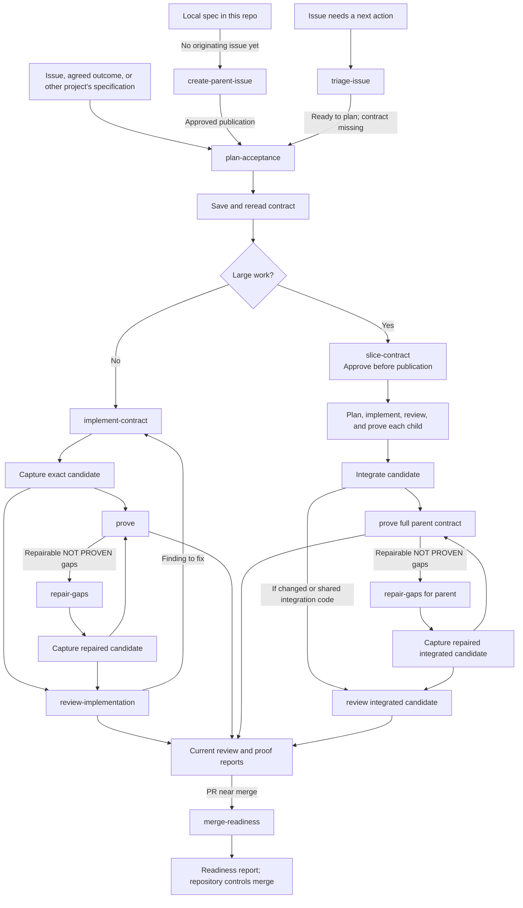

# Promise to Proof

Agent skills for carrying software requirements from promise to implementation
and evidence-backed acceptance.

It keeps the agreement, implementation, review, and proof separate so agents
can deliver exactly the promised capability: no less in substance, no more in scope.

The skills work with agent-skill-compatible coding tools. A saved acceptance
contract carries the source ticket's promises through implementation, review,
and proof. Reports identify the contract and exact candidate they describe.
The skills do not provide a workflow runtime.

New here? Start with the [HOW-TO](./docs/how-to.md) to choose and run a delivery
path. For questions about issues, slicing, review, and proof, read the
[FAQ](./docs/faq.md). [How to take a ticket from promise to proof](./docs/promise-to-proof.md)
gives the detailed workflow; the [acceptance contract protocol](./docs/acceptance-contract-protocol.md)
defines the shared contract, revision, and proof rules.

Issues and specifications for this repository live in [GitHub Issues](https://github.com/grove/promise-to-proof/issues).

## Choose a skill

### Start with an issue

| Skill | Use it when | It gives you |
|---|---|---|
| [`create-parent-issue`](./skills/productivity/create-parent-issue/SKILL.md) | A local specification needs one originating GitHub issue | One source issue with a durable reference to the exact spec |
| [`triage-issue`](./skills/productivity/triage-issue/SKILL.md) | An existing issue needs a next action or triage label | A recommendation and, when explicitly approved, a verified issue update |

### Shape the work

| Skill | Use it when | It gives you |
|---|---|---|
| [`critique`](./skills/productivity/critique/SKILL.md) | You explicitly request an independent review of a proposal against its intended outcome | Evidence-backed advice and a recommendation |
| [`interrogate`](./skills/productivity/interrogate/SKILL.md) | You want to question the agent's proposal and reasoning | Evidence-backed answers, a revised approach, and explicit unknowns |

### Plan and divide

| Skill | Use it when | It gives you |
|---|---|---|
| [`plan-acceptance`](./skills/productivity/plan-acceptance/SKILL.md) | A ticket needs clear acceptance criteria | A candidate-independent revision with stable requirement IDs and evidence plans |
| [`slice-contract`](./skills/productivity/slice-contract/SKILL.md) | A parent contract is too large for one coherent task | A traceable breakdown and, when authorized, published child tickets |

### Implement and verify

| Skill | Use it when | It gives you |
|---|---|---|
| [`implement-contract`](./skills/productivity/implement-contract/SKILL.md) | An agreed contract is ready to implement | Scoped implementation, development checks, and a recoverable candidate handoff |
| [`review-implementation`](./skills/productivity/review-implementation/SKILL.md) | A captured implementation is ready to inspect | Findings on contract fidelity, scope, and engineering quality |
| [`prove`](./skills/productivity/prove/SKILL.md) | Implementation is ready to verify | `PROVEN` or `NOT PROVEN` with evidence |
| [`merge-readiness`](./skills/productivity/merge-readiness/SKILL.md) | An existing PR is near a merge decision | Read-only readiness or specific blockers for the current PR state |

### Recover

| Skill | Use it when | It gives you |
|---|---|---|
| [`repair-gaps`](./skills/productivity/repair-gaps/SKILL.md) | Proof found specific repairable gaps | A scoped repair report; fresh proof is still required |
| [`fix-pr`](./skills/productivity/fix-pr/SKILL.md) | A pull request's CI failed | `FIXED` or `NOT FIXED` for the target workflow |

## Follow the workflow

Start with the [HOW-TO](./docs/how-to.md) for a GitHub issue, a local
specification, a large parent contract, a review finding, or failed proof. It
names the saved contract, candidate, and reports each phase needs. Read the
[FAQ](./docs/faq.md) when you need to distinguish child proof from parent proof,
review findings from proof gaps, or acceptance from CI and merge readiness.



Each arrow is an explicit handoff: save and pass the result, then invoke the
next skill. Skills do not invoke one another. `critique` and `interrogate` can
help shape a proposal before planning; `fix-pr` addresses failed CI and a
changed candidate needs fresh review and proof. If a promise must change, reconcile
the authorized amendment through `plan-acceptance` before continuing.

The [detailed workflow](./docs/promise-to-proof.md) includes examples and
recovery paths. The [acceptance contract protocol](./docs/acceptance-contract-protocol.md)
sets the rules for revisions, candidate identity, evidence, and durable handoffs.
Each skill returns a result for an explicit next invocation; the skills do not
call one another automatically.

## Use a skill

```text
/triage-issue #123
/critique <idea, document path, or GitHub issue reference>
/interrogate Walk me through your proposal so I can question it.
/plan-acceptance #123
/slice-contract #123; draft only
/implement-contract #123
/review-implementation <saved implementation handoff> against <comparison base>
/prove <saved contract>; candidate <saved implementation handoff>
/merge-readiness <PR URL>; review <saved report>; proof <saved report>
/repair-gaps <matching proof report>; candidate <saved candidate handoff>; requirements <IDs>
/fix-pr #456
```

The skills also accept direct ticket URLs or a specification when their skill
instructions describe that input.

## Install and update

Install the full collection:

```bash
npx skills@latest add grove/promise-to-proof
```

Install one skill:

```bash
npx skills@latest add grove/promise-to-proof --skill plan-acceptance
```

Update one installed skill:

```bash
npx skills@latest update plan-acceptance
```

If you installed `acceptance-contract`, `review-contract`, or `repair-proof`,
install `plan-acceptance`, `review-implementation`, and `repair-gaps` as
applicable, then remove the old copies using your installer's normal removal
mechanism.

## Repository structure

```text
skills/productivity/
├── create-parent-issue/
├── plan-acceptance/
├── critique/
├── fix-pr/
├── implement-contract/
├── interrogate/
├── merge-readiness/
├── prove/
├── repair-gaps/
├── review-implementation/
├── slice-contract/
└── triage-issue/
```

Each skill has a `SKILL.md`. Some also have an `agents/openai.yaml` display
metadata file. The [`checks/`](./checks/) directory contains small, human-runnable
workflow checks.

Shared protocol references are symlinks to `docs/acceptance-contract-protocol.md`.
The installer copies their contents into each selected skill, so individual
installs keep the protocol. Edit the canonical document to change shared rules.

## Contributing

1. Read [AGENTS.md](./AGENTS.md).
2. Find or create the relevant GitHub issue.
3. Change the smallest relevant skill.
4. Run the checks described by that skill.
5. Open a pull request that explains the behavior and evidence.

## License

Apache-2.0. See [LICENSE](./LICENSE).
