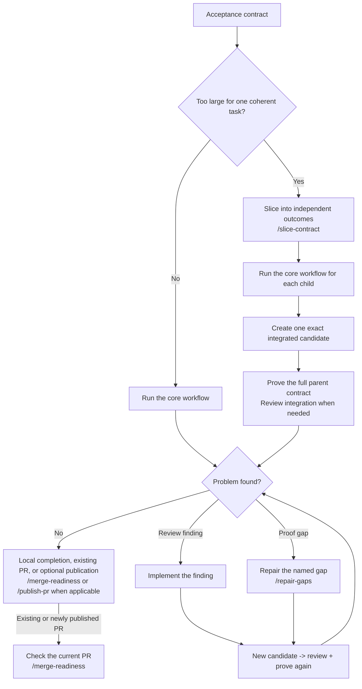

# Promise to Proof

Promise to Proof carries software requirements from an agreed outcome through
implementation to evidence-backed acceptance.

It keeps the agreement, implementation, review, and proof separate so the
promised capability does not get lost between ticket and implementation: no less
in substance, no more in scope.

## Why this exists

For developers using an issue tracker and coding agents, "done" can be hard to
trust. An agent may miss part of the requested behavior yet confidently report
success, or over-engineer a narrow task with features and abstractions nobody
asked for. Promise to Proof grew out of that experience: give the developer
responsible for the result a way to check that the agreed behavior was delivered,
without unapproved scope, on the exact code being accepted.

Issues and specifications for this repository live in [GitHub Issues](https://github.com/grove/promise-to-proof/issues).

## How Promise to Proof works

Promise to Proof turns an agreed outcome into a precise acceptance contract,
builds against that contract, then independently reviews the implementation and
proves the promised behavior on one exact candidate.

```mermaid
flowchart LR
  promise["1. Start with a promise<br/>Issue, spec, or agreed outcome"]
  plan["2. Propose what success means<br/>/plan-acceptance"]
  audit["Optional independent check<br/>/audit-acceptance"]
  contract["Saved acceptance contract<br/>What must be true + what evidence will prove it"]
  implement["3. Build exactly that<br/>/implement-contract"]
  candidate["Exact implementation candidate<br/>Commit or reproducible snapshot"]
  review["4a. Review: Is the implementation sound?<br/>/review-implementation"]
  prove["4b. Proof: Does the promised behavior actually hold?<br/>/prove"]
  done["5. The promise is backed by evidence<br/>Review + proof match this exact contract and candidate"]
  publish["6. Optional publication<br/>/publish-pr previews, then publishes with explicit authorization"]
  retrospect["Optional after acceptance<br/>/retrospect evaluates and proposes advisory learnings"]

  promise --> plan
  plan --> audit
  audit -->|Changes needed| plan
  audit -->|Ready; obtain any required approval| contract
  plan -->|No audit needed; obtain any required approval| contract
  contract --> implement --> candidate
  candidate --> review --> done
  candidate --> prove --> done
  done --> publish
  prove --> retrospect
```



Each stage answers a different question:

- **Promise:** What are we agreeing to deliver?
- **Plan acceptance:** What exactly would make that promise true?
- **Audit acceptance:** Is the exact proposal complete and fit for an approval decision?
- **Implementation:** Did we build what we agreed?
- **Review:** Is the implementation sound, faithful to the contract, and in scope?
- **Proof:** Does the promised behavior actually hold, with evidence for every outcome?
- **Publication:** Does the draft PR preserve the exact reviewed and proven candidate?
- **Retrospective (optional):** What did the accepted delivery teach us for later work?

For one coherent existing issue, `/deliver-issue` coordinates these distinct
skills and their saved handoffs when the host supports separate stage and
independent review/proof contexts. Each stage remains available on its own.
Capture the candidate as a commit or reproducible snapshot so review and proof
refer to the same exact implementation and contract. Start with the
[HOW-TO](./docs/how-to.md) for the saved artifacts and commands.

## Install and update

The skills work with agent-skill-compatible coding tools. A saved acceptance
contract carries the source ticket's promises through implementation, review,
and proof. Issue-first delivery needs a host capable of separate stage invocations
and independent read-only review and proof contexts; otherwise it reports a blocker.

Install the full collection:

```bash
npx skills@latest add grove/promise-to-proof
```

Install one skill:

```bash
npx skills@latest add grove/promise-to-proof --skill plan-acceptance
```

Update one installed skill:

```bash
npx skills@latest update plan-acceptance
```

If you installed `acceptance-contract`, `review-contract`, or `repair-proof`,
install `plan-acceptance`, `review-implementation`, and `repair-gaps` as
applicable, then remove the old copies using your installer's normal removal
mechanism.

For a new project using GitHub issues, run
[`/setup-promise-to-proof`](./skills/productivity/setup-promise-to-proof/SKILL.md)
before tracker-writing or triage work. It proposes issue-tracker, triage-label,
and domain-doc pointers for your approval; it does not create GitHub labels,
issues, or domain documents. Skip it if compatible `docs/agents/` files already
exist for your GitHub repository and labels, for example after running Matt
Pocock's `/setup-matt-pocock-skills`. The core workflow can start from a local
specification without this setup.

## Start with an issue

For one coherent existing issue, run [`/deliver-issue`](./skills/productivity/deliver-issue/SKILL.md)
with its reference (for example, `/deliver-issue #123` in a GitHub-configured
project). It saves and rereads the agreement, captures a fixed candidate, and
returns matching review and proof reports or a named blocker. It does not commit,
publish, or update triage labels without separate authority. See the
[issue-first checks](./checks/deliver-issue-scenarios.md) for test cases.

## Use the stage skills

Start with these four skills in order:

[`/plan-acceptance`](./skills/productivity/plan-acceptance/SKILL.md) →
[`/implement-contract`](./skills/productivity/implement-contract/SKILL.md) →
[`/review-implementation`](./skills/productivity/review-implementation/SKILL.md) +
[`/prove`](./skills/productivity/prove/SKILL.md)

### Other skills when you need them

| Skill | Use it when | It gives you |
|---|---|---|
| [`/setup-promise-to-proof`](./skills/productivity/setup-promise-to-proof/SKILL.md) | A new project's GitHub issue and domain-doc pointers need configuring | An approved local configuration for tracker, triage labels, and domain docs |
| [`/audit-acceptance`](./skills/productivity/audit-acceptance/SKILL.md) | A proposed contract needs an independent check before human approval | Read-only source, scope, identity, and evidence-plan findings |
| [`/create-parent-issue`](./skills/productivity/create-parent-issue/SKILL.md) | A local specification needs one originating GitHub issue | One source issue with a durable reference to the exact spec |
| [`/triage-issue`](./skills/productivity/triage-issue/SKILL.md) | An existing issue needs a next action or triage label | A recommendation and, when explicitly approved, a verified issue update |
| [`/critique`](./skills/productivity/critique/SKILL.md) | You explicitly request an independent review of a proposal against its intended outcome | Evidence-backed advice and a recommendation |
| [`/interrogate`](./skills/productivity/interrogate/SKILL.md) | You want to question the agent's proposal and reasoning | Evidence-backed answers, a revised approach, and explicit unknowns |
| [`/slice-contract`](./skills/productivity/slice-contract/SKILL.md) | A parent contract is too large for one coherent task | A traceable breakdown and, when authorized, published child tickets |
| [`/repair-gaps`](./skills/productivity/repair-gaps/SKILL.md) | Proof found specific repairable gaps | A scoped repair report; fresh proof is still required |
| [`/retrospect`](./skills/productivity/retrospect/SKILL.md) | A proven delivery has concrete post-acceptance experience worth examining | A historical evaluation and optional human-accepted advice for future planning |
| [`/publish-pr`](./skills/productivity/publish-pr/SKILL.md) | A reviewed and proven candidate should become a draft PR | An exact preview or a content-verified remote PR |
| [`/merge-readiness`](./skills/productivity/merge-readiness/SKILL.md) | An existing PR is near a merge decision | Read-only readiness or specific blockers for the current PR state |
| [`/fix-pr`](./skills/productivity/fix-pr/SKILL.md) | A pull request's CI failed | `FIXED` or `NOT FIXED` for the target workflow |

## Use a skill

```text
/plan-acceptance #123
/implement-contract #123
/review-implementation <saved implementation handoff> against <comparison base>
/prove <saved contract>; candidate <saved implementation handoff>
```

<details>
<summary>Other commands</summary>

```text
/setup-promise-to-proof
/triage-issue #123
/critique <idea, document path, or GitHub issue reference>
/interrogate Walk me through your proposal so I can question it.
/audit-acceptance <exact proposed contract> against <source>
/slice-contract #123; draft only
/publish-pr <verified candidate and reports>; target <branch>; draft only
/merge-readiness <PR URL>; review <saved report>; proof <saved report>
/repair-gaps <matching proof report>; candidate <saved candidate handoff>; requirements <IDs>
/retrospect <saved PROVEN proof>; candidate <exact proven candidate>; experience <retrievable observations>
/fix-pr #456
```

</details>

The skills also accept direct ticket URLs or a specification when their skill
instructions describe that input.

## Advanced and recovery paths



Before planning, use `/triage-issue` for an issue needing a next action, or
`/create-parent-issue` for a local spec in this repo needing an originating
issue. `/critique` and `/interrogate` can help settle a proposal first.

For published child issues, save a contract and run the direct path for each
child. Child proof does not replace `/prove` for the integrated parent. Review
the integrated candidate if it differs from the reviewed child candidates or
contains shared integration code. After any repair, capture the changed candidate
and refresh review and proof. `/fix-pr` addresses failed CI. If a promise changes,
reconcile the authorized amendment through `/plan-acceptance` before continuing.

After matching review and proof, `/publish-pr` prepares a read-only preview and,
with exact authorization, publishes that candidate as a draft PR. For an existing
PR near merge, `/merge-readiness` checks the current review, proof, CI, and
repository merge conditions without merging the PR. Read the
[FAQ](./docs/faq.md) for the distinction between acceptance and merge readiness.

## Detailed docs

New here? Start with the [HOW-TO](./docs/how-to.md) to choose and run a delivery
path. For questions about issues, slicing, review, and proof, read the
[FAQ](./docs/faq.md).

The [detailed workflow](./docs/promise-to-proof.md) includes examples and
recovery paths, including an optional
[retrospective walkthrough](./docs/promise-to-proof.md#learn-from-a-proven-delivery-optional)
after proof. The [acceptance contract protocol](./docs/acceptance-contract-protocol.md)
sets the rules for revisions, candidate identity, evidence, and durable handoffs.
The [acceptance bundle format](./docs/acceptance-bundle-v1.md) defines optional
deterministic inspection of matching review and proof artifacts.
Each skill ends with numbered next steps so you can refer to a specific action.
Some completed results need no further action; stage skills do not call one
another automatically. `/deliver-issue` coordinates them for one issue.

## Repository structure

```text
skills/productivity/
├── audit-acceptance/
├── create-parent-issue/
├── deliver-issue/
├── plan-acceptance/
├── critique/
├── fix-pr/
├── implement-contract/
├── interrogate/
├── merge-readiness/
├── prove/
├── publish-pr/
├── repair-gaps/
├── retrospect/
├── review-implementation/
├── slice-contract/
├── setup-promise-to-proof/
└── triage-issue/
```

Each skill has a `SKILL.md`. Some also have an `agents/openai.yaml` display
metadata file. The [`checks/`](./checks/) directory contains human-runnable
workflow scenarios and the dependency-free acceptance bundle checker.

Shared protocol references are symlinks to `docs/acceptance-contract-protocol.md`.
The installer copies their contents into each selected skill, so individual
installs keep the protocol. Edit the canonical document to change shared rules.

## Contributing

1. Read [AGENTS.md](./AGENTS.md).
2. Find or create the relevant GitHub issue.
3. Change the smallest relevant skill.
4. Run the checks described by that skill.
5. Open a pull request that explains the behavior and evidence.

## License

Apache-2.0. See [LICENSE](./LICENSE).
