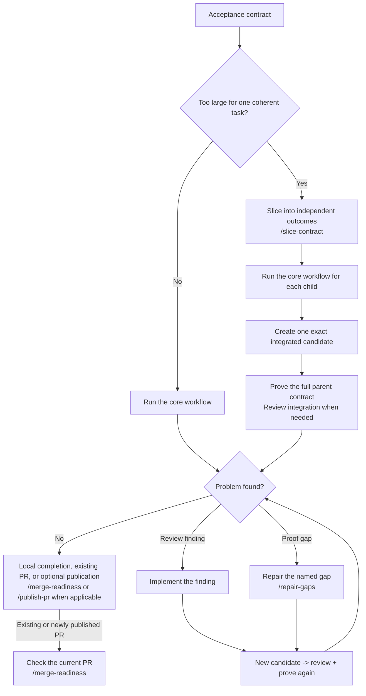

# Promise to Proof

Promise to Proof carries software requirements from an agreed outcome through
implementation to evidence-backed acceptance.

It keeps the agreement, implementation, review, and proof separate so the
promised capability does not get lost between ticket and implementation: no less
in substance, no more in scope.

## Current focus

Implement exactly what was promised, prove it thoroughly, and deliver that exact
result. The controller now keeps active execution and recovery state in disposable
local Git storage outside the project checkout. Issue-backed deliveries can save
compact completion metadata on GitHub, leaving product code and tests in Git.

Further work focuses on precise acceptance contracts, requirement-to-evidence
traceability, and verification of important seams and edge cases without unnecessary
ceremony. Fixed delivery strategy comparison remains the next evaluation step;
automatic strategy selection is later work.

## Why this exists

For developers using an issue tracker and coding agents, "done" can be hard to
trust. An agent may miss part of the requested behavior yet confidently report
success, or over-engineer a narrow task with features and abstractions nobody
asked for. Promise to Proof grew out of that experience: give the developer
responsible for the result a way to check that the agreed behavior was delivered,
without unapproved scope, on the exact code being accepted.

## Current status and next steps

The project now has an executable delivery controller and model-based checks:

- A [bounded FizzBee model](./checks/delivery-model/README.md) checks completion
  rules for contract and candidate identity, durable evidence, repair, and restart.
- The [delivery controller](./docs/p2p-delivery-controller.md) runs one established
  local agreement through implementation, independent review and proof, and at
  most one automatic repair. It supports macOS with Codex CLI and retains progress
  for resume in an isolated, disposable Git workspace outside the source checkout.
  Dispatch and elapsed-time limits bound execution; a hard monetary cap is unsupported.
- Delivery freezes its comparison base at admission. Later destination movement
  is recorded separately and does not trigger another review or proof run by itself.
  Completion against that base does not establish compatibility with the current target.
- Issue-backed completion supports an explicitly authorized, read-back-verified
  GitHub comment and fresh-checkout status inspection. Cleanup removes local execution
  state only after the source candidate and required records have been verified.
- [Conformance tests](./checks/delivery-model/README.md#controller-conformance-phase-3)
  drive the controller's public CLI against FizzBee-generated action sequences.
  They check restart, stale reports, interrupted storage, repair limits, and
  overlapping resume attempts, including deliberately broken controller variants.

Model exploration is bounded, and conformance tests use substitute worker replies.
Real host checks separately exercise isolation and stage execution. These checks
do not establish the quality of agent judgments or prove every controller execution.

The next planned step is to compare fixed delivery strategies on the supported
host, with agreed tasks, independent correctness judgments, and an improvement
threshold. Additional hosts and automatic strategy selection remain later work.
See the [optimization plan](./plans/promise_to_proof_optimization_handoff.md).

Specifications live in `specs/` and local acceptance contracts in `work/`.
Standalone skills save handoffs in `.p2p/work/`; the controller keeps active
execution state under `~/.p2p/work/<repo-id>/<work-item>/`. Issue-backed controller
delivery uses a compact GitHub completion record rather than requiring P2P files
in the delivered commit. GitHub remains optional for local work.
See the [controller guide](./docs/p2p-delivery-controller.md) for the storage and
cleanup paths, and the [migration guide](./docs/p2p-state-migration.md) for removing
existing P2P-owned files from the current Git tree without rewriting history.

## How Promise to Proof works

Promise to Proof turns an agreed outcome into a precise acceptance contract,
builds against that contract, then independently reviews the implementation and
proves the promised behavior on one exact candidate.


```mermaid
flowchart LR
  promise["1. Start with a promise<br/>Issue, spec, or agreed outcome"]
  plan["2. Propose what success means<br/>/plan-acceptance"]
  audit["Optional independent check<br/>/audit-acceptance"]
  contract["Saved acceptance contract<br/>What must be true + what evidence will prove it"]
  implement["3. Build exactly that<br/>/implement-contract"]
  candidate["Exact implementation candidate<br/>Commit or reproducible snapshot"]
  review["4a. Review: Is the implementation sound?<br/>/review-implementation"]
  prove["4b. Proof: Does the promised behavior actually hold?<br/>/prove"]
  done["5. The promise is backed by evidence<br/>Review + proof match this exact contract and candidate"]
  publish["6. Optional publication<br/>/publish-pr previews, then publishes with explicit authorization"]
  retrospect["Optional after acceptance<br/>/retrospect evaluates and proposes advisory learnings"]

  promise --> plan
  plan --> audit
  audit -->|Changes needed| plan
  audit -->|Ready; obtain any required approval| contract
  plan -->|No audit needed; obtain any required approval| contract
  contract --> implement --> candidate
  candidate --> review --> done
  candidate --> prove --> done
  done --> publish
  prove --> retrospect
```

Each stage answers a different question:

- **Promise:** What are we agreeing to deliver?
- **Plan acceptance:** What exactly would make that promise true?
- **Audit acceptance:** Is the exact proposal complete and fit for an approval decision?
- **Implementation:** Did we build what we agreed?
- **Review:** Is the implementation sound, faithful to the contract, and in scope?
- **Proof:** Does the promised behavior actually hold, with evidence for every outcome?
- **Publication:** Does the draft PR preserve the exact reviewed and proven candidate?
- **Retrospective (optional):** What did the accepted delivery teach us for later work?

For one coherent work item, `/deliver-issue` coordinates these distinct
skills and their saved handoffs when the host supports separate stage and
independent review/proof contexts. Each stage remains available on its own.
Capture the candidate as a commit or reproducible snapshot so review and proof
refer to the same exact implementation and contract. Start with the
[HOW-TO](./docs/how-to.md) for the saved artifacts and commands.

## Install and update

The skills work with agent-skill-compatible coding tools. A saved acceptance
contract carries the work item's promises through implementation, review,
and proof. Coordinated delivery needs a host capable of separate stage invocations
and independent read-only review and proof contexts; otherwise it reports a blocker.

Install the full collection:

```bash
npx skills@latest add grove/promise-to-proof
```

Install one skill:

```bash
npx skills@latest add grove/promise-to-proof --skill plan-acceptance
```

Update one installed skill:

```bash
npx skills@latest update plan-acceptance
```

If you installed `acceptance-contract`, `review-contract`, or `repair-proof`,
install `plan-acceptance`, `review-implementation`, and `repair-gaps` as
applicable, then remove the old copies using your installer's normal removal
mechanism.

For a new project, run
[`/setup-promise-to-proof`](./skills/productivity/setup-promise-to-proof/SKILL.md).
It establishes the local directories and ignore convention, detects conflicts,
and preserves existing configuration. Configure GitHub only when you want its
optional import, triage, or publication flows.

## Start with a local work item

```text
/plan-acceptance specs/retry-safe-uploads.md
/deliver-issue work/retry-safe-uploads.md
```

A separate specification is optional. Give `plan-acceptance` an agreed outcome
to create a standalone work item. The work file holds the acceptance contract;
standalone stage reports and evidence go under `.p2p/work/retry-safe-uploads/`.
Coordinated delivery keeps its active workspace, reports, and recovery state under
the user-level work root outside the checkout. Resume with the same work-item path.

`deliver-issue` retains its command name and also accepts a tracker reference
for import. It coordinates independent review and proof when the host supports
them. It does not commit, publish, or update trackers without separate authority.
See the [delivery checks](./checks/deliver-issue-scenarios.md).

For direct CLI execution on macOS, follow the
[controller guide](./docs/p2p-delivery-controller.md). It requires Python 3.11 or
newer, Git, an authenticated Codex CLI, and installed delivery stage skills.
Use `run`, `status`, and `resume` to execute and inspect a delivery. A successful
run returns an isolated candidate with matching full `REVIEWED` and `PROVEN`
reports. Apply that candidate to the source checkout before explicit `cleanup`.
Commit and publication remain separately authorized steps.

For an issue-backed delivery, commit the accepted product candidate, then use
`github-record-preview` to inspect the compact completion comment.
`github-record-publish` requires authorization for that exact preview hash.
`github-status` validates the completed record against local Git history in a fresh
checkout. Cleanup verifies the issue comment again before deleting execution state.
For local delivery, cleanup retains compact candidate, delivery, review, and proof
records in `.p2p/work/<slug>/`; these records do not reconstruct the candidate.

## Plan on an issue before delivery

Run `/plan-acceptance <issue>` to save a local proposal and post its exact text
as a comment on that existing issue. Add `local-only` or `draft-only` to suppress
the comment. The handoff includes the work-item path, revision, text hash, and
retrievable binding inputs. Posting the proposal does not approve it.

Approve the specific proposal on the issue, then run `/deliver-issue <issue>`
in the same or another checkout. Delivery imports the exact approved contract
and binding inputs into the local workflow. Matching inputs retain their approval;
changed or conflicting inputs require reconciliation. If approval exists only
in conversation, transfer the saved approval receipt to the delivery checkout.
No preliminary planning PR is required.

Planning inside `/deliver-issue` stays local unless issue publication has separate
authorization. See [Plan on an issue before delivery](./docs/how-to.md#plan-on-an-issue-before-delivery)
for the handoff procedure.

## Use the stage skills

Start with these four skills in order:

[`/plan-acceptance`](./skills/productivity/plan-acceptance/SKILL.md) →
[`/implement-contract`](./skills/productivity/implement-contract/SKILL.md) →
[`/review-implementation`](./skills/productivity/review-implementation/SKILL.md) +
[`/prove`](./skills/productivity/prove/SKILL.md)

### Other skills when you need them

| Skill | Use it when | It gives you |
|---|---|---|
| [`/setup-promise-to-proof`](./skills/productivity/setup-promise-to-proof/SKILL.md) | A project needs local P2P storage | Local directories, validated Git rules, and optional tracker configuration |
| [`/audit-acceptance`](./skills/productivity/audit-acceptance/SKILL.md) | A proposed contract needs an independent check before human approval | Read-only source, scope, identity, and evidence-plan findings |
| [`/create-parent-issue`](./skills/productivity/create-parent-issue/SKILL.md) | A local specification needs one originating GitHub issue | One source issue with a durable reference to the exact spec |
| [`/triage-issue`](./skills/productivity/triage-issue/SKILL.md) | An existing issue needs a next action or triage label | A recommendation and, when explicitly approved, a verified issue update |
| [`/critique`](./skills/productivity/critique/SKILL.md) | You explicitly request an independent review of a proposal against its intended outcome | Evidence-backed advice and a recommendation |
| [`/interrogate`](./skills/productivity/interrogate/SKILL.md) | You want to question the agent's proposal and reasoning | Evidence-backed answers, a revised approach, and explicit unknowns |
| [`/slice-contract`](./skills/productivity/slice-contract/SKILL.md) | A parent contract is too large for one coherent task | Linked child work items and an approved delivery plan; [mixed destinations and strategy changes](./docs/how-to.md#deliver-an-epic-with-mixed-destinations) |
| [`/repair-gaps`](./skills/productivity/repair-gaps/SKILL.md) | Proof found specific repairable gaps | A scoped repair report; fresh proof is still required |
| [`/retrospect`](./skills/productivity/retrospect/SKILL.md) | A proven delivery has concrete post-acceptance experience worth examining | A historical evaluation and optional human-accepted advice for future planning |
| [`/publish-pr`](./skills/productivity/publish-pr/SKILL.md) | A reviewed and proven candidate should become a draft PR | An exact preview or a content-verified remote PR |
| [`/merge-readiness`](./skills/productivity/merge-readiness/SKILL.md) | An existing PR is near a merge decision | Current readiness or blockers, recorded in the PR description |
| [`/fix-pr`](./skills/productivity/fix-pr/SKILL.md) | A pull request's CI failed | `FIXED` or `NOT FIXED` for the target workflow |

## Use a skill

```text
/plan-acceptance work/retry-safe-uploads.md
/implement-contract work/retry-safe-uploads.md
/review-implementation <saved implementation handoff> against <comparison base>
/prove <saved contract>; candidate <saved implementation handoff>
```

<details>
<summary>Other commands</summary>

```text
/setup-promise-to-proof
/triage-issue #123
/critique <idea, document path, or GitHub issue reference>
/interrogate Walk me through your proposal so I can question it.
/audit-acceptance <exact proposed contract> against <source>
/slice-contract work/retry-safe-uploads.md; draft only
/publish-pr <verified candidate and reports>; target <branch>; draft only
/merge-readiness <PR URL>; review <saved report>; proof <saved report>
/repair-gaps <matching proof report>; candidate <saved candidate handoff>; requirements <IDs>
/retrospect <saved PROVEN proof>; candidate <exact proven candidate>; experience <retrievable observations>
/fix-pr #456
```

</details>

The skills also accept direct ticket URLs or a specification when their skill
instructions describe that input.

## Advanced and recovery paths


```mermaid
flowchart TD
  contract["Acceptance contract"] --> large{"Too large for one coherent task?"}
  large -->|No| core["Run the core workflow"]
  large -->|Yes| slice["Slice into independent outcomes<br/>/slice-contract"]
  slice --> children["Run the core workflow for each child"]
  children --> integrated["Create one exact integrated candidate"]
  integrated --> parent["Prove the full parent contract<br/>Review integration when needed"]

  core --> problem{"Problem found?"}
  parent --> problem
  problem -->|No| pr["Local completion, existing PR, or optional publication<br/>/merge-readiness or /publish-pr when applicable"]
  pr -->|Existing or newly published PR| ready["Check the current PR<br/>/merge-readiness"]
  problem -->|Review finding| fix["Implement the finding"]
  problem -->|Proof gap| repair["Repair the named gap<br/>/repair-gaps"]
  fix --> rerun["New candidate -> review + prove again"]
  repair --> rerun
  rerun --> problem
```

For optional tracker work, use `/triage-issue` for an issue needing a next
action or `/create-parent-issue` to preview a spec mirror. `/critique` and `/interrogate` can help settle a proposal first.

For local children, plan acceptance in each child work file and run the direct
path for that child. Child proof does not replace `/prove` for the integrated parent. Review
the integrated candidate if it differs from the reviewed child candidates or
contains shared integration code. After any repair, capture the changed candidate
and refresh review and proof. `/fix-pr` addresses failed CI. If a promise changes,
reconcile the authorized amendment through `/plan-acceptance` before continuing.

After matching review and proof, `/publish-pr` prepares a read-only preview and,
with exact authorization, publishes that candidate as a draft PR. For an existing
PR near merge, `/merge-readiness` checks the current review, proof, CI, and
repository merge conditions without merging the PR. Read the
[FAQ](./docs/faq.md) for the distinction between acceptance and merge readiness.

## Keep delivery state out of product history

The controller stores candidate generations and recovery state in disposable
local Git storage under `~/.p2p/work/<repo-id>/<work-item>/`. Keep that storage
while delivery is active, interrupted, or unresolved. Explicit cleanup checks the
source checkout against the accepted candidate before removing it.

Issue-backed deliveries retain compact completion metadata on GitHub under exact
comment authority. Local deliveries retain four final records in `.p2p/work/`.
Standalone skills still use the [protocol's durable handoffs](./docs/acceptance-contract-protocol.md#durable-generated-records).
Do not blanket-delete project-authored files in `work/` or `specs/` when migrating
old P2P state. Follow the [migration guide](./docs/p2p-state-migration.md).

For standalone checks, use `.p2p/tmp/` or an OS temporary directory. Save meaningful
commands, assertions, results, and environment details in the report, and retain
separate evidence only when needed. The setup convention ignores `/.p2p/tmp/`.
Existing committed evidence can use Git history and an `archive.md` recovery index;
see [Reduce retained work data](./docs/how-to.md#reduce-retained-work-data).

## Detailed docs

New here? Start with the [HOW-TO](./docs/how-to.md) to choose and run a delivery
path. For questions about issues, slicing, review, and proof, read the
[FAQ](./docs/faq.md).

The [detailed workflow](./docs/promise-to-proof.md) includes examples and
recovery paths, including an optional
[retrospective walkthrough](./docs/promise-to-proof.md#learn-from-a-proven-delivery-optional)
after proof. The [acceptance contract protocol](./docs/acceptance-contract-protocol.md)
sets the rules for revisions, candidate identity, evidence, and durable handoffs.
The [acceptance bundle format](./docs/acceptance-bundle-v1.md) defines optional
deterministic inspection of matching review and proof artifacts.
Each skill ends with numbered next steps so you can refer to a specific action.
Some completed results need no further action; stage skills do not call one
another automatically. `/deliver-issue` coordinates them for one work item.

## Repository structure

```text
skills/productivity/
├── audit-acceptance/
├── create-parent-issue/
├── deliver-issue/
├── plan-acceptance/
├── critique/
├── fix-pr/
├── implement-contract/
├── interrogate/
├── merge-readiness/
├── prove/
├── publish-pr/
├── repair-gaps/
├── retrospect/
├── review-implementation/
├── slice-contract/
├── setup-promise-to-proof/
└── triage-issue/
```

Each skill has a `SKILL.md`. Some also have an `agents/openai.yaml` display
metadata file. The [`checks/`](./checks/) directory contains workflow scenarios,
filesystem and controller tests, the acceptance bundle checker, and the
FizzBee model and conformance suite.

Shared protocol references are symlinks to `docs/acceptance-contract-protocol.md`.
The installer copies their contents into each selected skill, so individual
installs keep the protocol. Shared `scripts/p2p_filesystem.py` links likewise
resolve to the implementation in `deliver-issue/scripts/`. Edit the canonical
files to change shared behavior. Run the Python fixture tests with:

```bash
python3 -m unittest discover -s checks -p 'test_*.py'
```

The [model and conformance checks](./checks/delivery-model/README.md) have separate
commands and pinned tool requirements. The [live host check](./docs/p2p-delivery-controller.md#host-boundary-and-checks)
runs separately and makes real model calls.

## Contributing

1. Read [AGENTS.md](./AGENTS.md).
2. Find or plan the relevant `work/<slug>.md` acceptance contract.
3. Change the smallest relevant skill.
4. Run the checks described by that skill.
5. Open a pull request that explains the behavior and evidence.

## License

Apache-2.0. See [LICENSE](./LICENSE).
